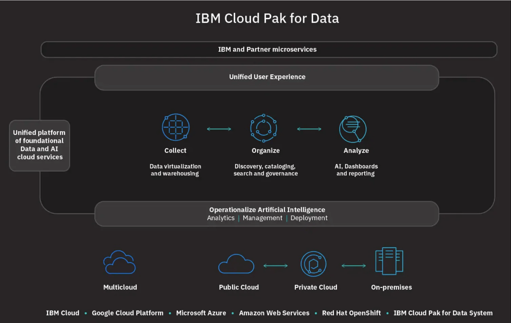

# ASEANZK Cloud Pak for Data – Practicum

**Refer to below table for Cloud Pak For Data(CP4D) Practicum Lab Exercise Book.**

<table style="width:100%;">
<colgroup>
<col style="width: 10%" />
<col style="width: 19%" />
<col style="width: 21%" />
<col style="width: 24%" />
<col style="width: 23%" />
</colgroup>
<thead>
<tr class="header">
<th><blockquote>

<strong>Scenario</strong>

</blockquote></th>
<th><blockquote>

<strong>Use Case (TBC)</strong>

</blockquote></th>
<th><blockquote>

<strong>CP4D Products Used</strong>

</blockquote></th>
<th><blockquote>

<strong>Authors</strong>

</blockquote></th>
<th><blockquote>

<strong>Slack Channel</strong>

</blockquote></th>
</tr>
</thead>
<tbody>

<tr class="odd">
<td>
<u>

[Scenario1](/scenario1/README.md)
</u>

</td>
<td>

Data Integration / Data Virtualization

</td>
<td>

Watson Query

Watson Studio

</td>
<td>

<strong>Sandeep</strong> Ved

<strong>Paul</strong> Jose

</td>
<td>

#XYZ-ASEANZ-ICP4D-PRACTICUM-SCENARIO-1

</td>
</tr>

<tr class="even">
<td>

<u>

[Scenario2](/scenario2/README.md)
</u>

</td>
<td>

MLOps and Trustworthy AI

</td>
<td>

Watson Studio with Watson AutoAI (WSL)

Watson Machine Learning (WML)

Watson OpenScale (WOS)

</td>
<td>

<strong>Teerarat</strong> Siwapathomchai

<strong>Indrajit</strong> Mukherjee

</td>
<td>

#XYZ-ASEANZ-ICP4D-PRACTICUM-SCENARIO-2

</td>
</tr>

<tr class="odd">
<td>
<u>

[Scenario3](/scenario3/README.md)
</u>

</td>
<td>

Data Governance &amp; Privacy

</td>
<td>

WKC

Watson Studio

</td>
<td>

<strong>John</strong> Isaac

<strong>Duc</strong> Duong Quang

</td>
<td>

#XYZ-ASEANZ-ICP4D-PRACTICUM-SCENARIO-3

</td>
</tr>

<tr class="even">
<td>
<u>

[Scenario4](/scenario4/README.md)
</u>

</td>
<td>

Customer Care

</td>
<td>

Watson Assistant

Watson Discovery

</td>
<td>

<strong>TBD</strong> 

<strong>TBD</strong> 

</td>
<td>

#XYZ-ASEANZ-ICP4D-PRACTICUM-SCENARIO-4

</td>
</tr>

<tr class="odd">
<td>
<u>

[Scenario5 (Common)](/scenario5/README.md)
</u>

</td>
<td>

IBM CP4D Installation 

</td>
<td>

ICM Cloud Pak for Data

</td>
<td>

<strong>Sujatha Sureshkumar</strong> 

<strong>TBD</strong> 

</td>
<td>

#XYZ-ASEANZ-ICP4D-PRACTICUM-SCENARIO-5

</td>
</tr>

</tbody>
</table>

**<u>Practicum Contact:</u>** **Siva** Kumar
