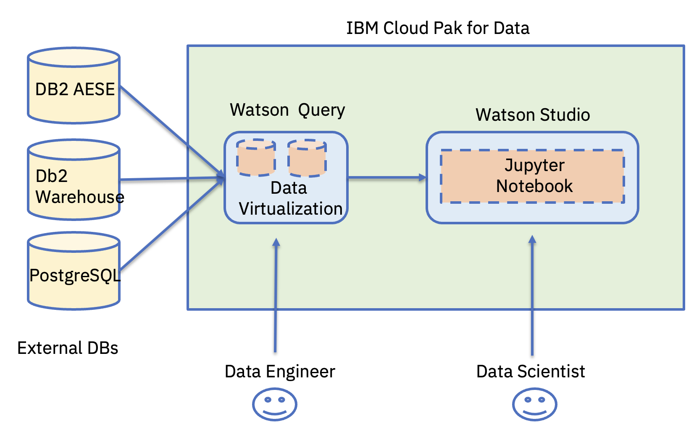
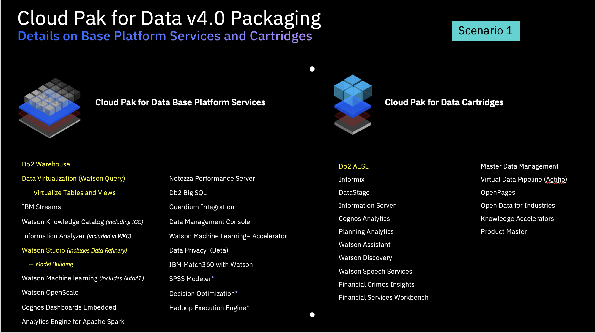

# ASEANZK Cloud Pak for Data – Practicum Scenario 1

[**Use Case**](#_Toc109841328)

[**Scenario Description**](#_Toc109841329)

[**High Level Architecture**](#_Toc109841330)

[**Product Used**](#_Toc109841331)

[**Environment Details**](#_Toc109841332)

[**Reference Implementation Steps**](#_Toc109841333)

------

**Use Case**

Data Integration / Data Virtualization

**Scenario Description**

XYZ is currently using the data coming from multiple sources to build
their models and dashboards. They run one large query overnight to bring
the data from the two sources into a central location before running a
series of data processing jobs to get the final dataset to be used on
the dashboard.

Your objective is to use IBM Cloud Pak for Data features to avoid the
need of running the bottleneck query. The main features to focus on here
are Data Virtualization  then Watson Query.

​
**High Level Architecture**

Below is the high level architecture that we plan to implement as part
of this scenario.

**Product Used**

The list of products used in the solution are highlighted below.

**Environment Details**

Use the below IBM Cloud Env Details for Scenario Implementation.
Credentials will be available in the slack Channel.

**TBD**

 **Reference Implementation Steps** 

Refer to attached [**PDF**](Scenario1.pdf) here for reference.
