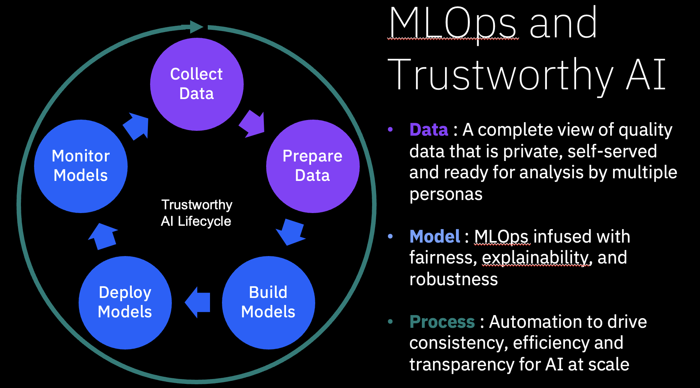
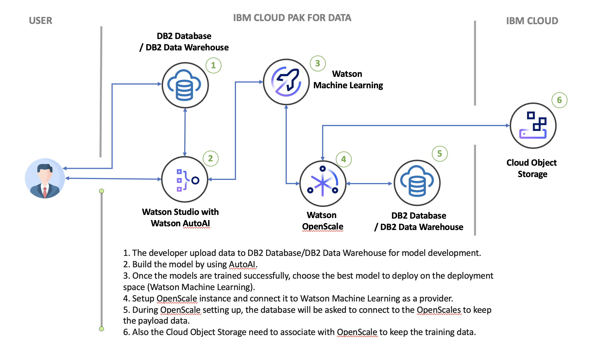

# ASEANZK Cloud Pak for Data – Practicum Scenario 2

[**Use Case**](#_Toc109841334)

[**Scenario Description**](#_Toc109841335)

[**High Level Architecture**](#_Toc109841336)

[**Product Used**](#_Toc109841337)

[**Environment Details**](#_Toc109841338)

[**Reference Implementation Steps**](#_Toc109841339)

------

**Use Case**

Model Development / Model Deployment / Monitoring 

**Scenario Description**

Credit risk is significant for the banking business. If the borrower fails to repay, it results in a loss. To minimize loan from the bank's perspective, ABC Bank needs a decision rule regarding to give approval of the loan and who not to. They decided to implement Application Score (A-Score) model to  access loan application based on application's demographic and economic profiles. Loan analyst who has no programming skill has been asked to develop the model. The saved model need to be deployed machine learning engineer and generate the API for the front-end application. Due to economic uncertianty can cause the customer behaviour change which affects to the model. To avoid the oppotunity cost in business from dropping in model accuracy. The team also has been asked to set up the instance to monitor the model after deploying.

The company has recently acquired Cloud Pak for Data v4 and are planning to utilize its key features to achieve the following goals ​:

- 1. Accelerate model development without programming skill.
- 2. Save and deploy model seamlessly to reduce friction between model developer and machine learning engineer.
- 3. The model need to be an "on-line" deployment with API for the front end application. 
- 4. After deployment successfully, you also have been asked to set up instance to monitor the model to see there are any changes affect to the model (Drift and Fariness fro example).

​
**High Level Architecture**

Below is the high level architecture that we plan to implement as part
of this scenario.

**Product Used**

Your objective is to use IBM Cloud Pak for Data features to develop, deploy and monitor model under the MLOps and trustwothy AI concept. The key products you will be used for this project are here;

- 1x Watson Studio (WSL) with AutoAI
- 1x Watson Machine Learning (WML) 
- 1x Watson OpenScale instane. 
- 2x DB2 Database or DataWarehouse (1x for Training data storing, 1x for Watson OpenScale set up)
- 1x Cloud Object Storage (for Watson OpenScale to keep training data)

**Environment Details**

Use the below IBM Cloud Env Details for Scenario Implementation.
Credentials will be available in the slack Channel.

**TBD**

 **Reference Implementation Steps** 

Click [**Here**](Scenario1.pdf) for reference. (To be Updated)
