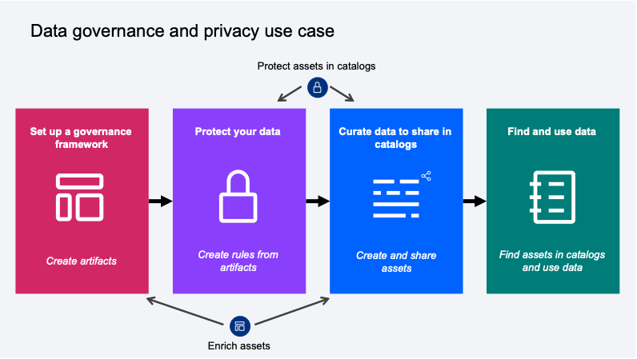

# ASEANZK Cloud Pak for Data – Practicum Scenario 3

[**Use Case**](#_Toc109841344)

[**Scenario Description**](#_Toc109841345)

[**High Level Architecture**](#_Toc109841346)

[**Product Used**](#_Toc109841347)

[**Environment Details**](#_Toc109841348)

[**Reference Implementation Steps**](#_Toc109841349)

------

**Use Case**

Data Governance and Privacy: Created a trusted, business-ready data foundation for a data fabric.

**Scenario Description**

Golden Bank has several departmens that need to access to high-quality customer mortgage data. As a Data Steward of the Data Goverance team, you are tasked to sort and organize the company's data to provide high-quality and protected data assets that data consumers can easily find in a self-service catalog.

To implement data governance and privacy, the organization can follow this process:

1/ Set up a governance framework

2/ Create rules to protect data

3/ Curate data to share in catalogs

4/ Find and use data

​
**High Level Architecture**

**Product Used**

The components used in this project are as below.
- The Watson Knowledge Catalog (WKC) service in Cloud Pak for Data provides all of the tools and processes that your organization needs to implement a data governance and privacy solution. 
- The Watson Studio provides tools needed for data consumers to find and analyze data. 

**Environment Details**

Use IBM Cloud Pak for Data platform to implement the scenario. Sign up for Clould Pak for Data as a Service and provision the necessary services for the Data Governance and Privacy use case. Please refer to the lab guidance for more details.

 **Reference Implementation Steps** 

- Please use [**This Lab**](Scenario3_ROSA.pdf) for practicing in ROSA environment.

- Please use [**This Lab**](Scenario3_Saas.pdf) for practicing in Saas environment.
